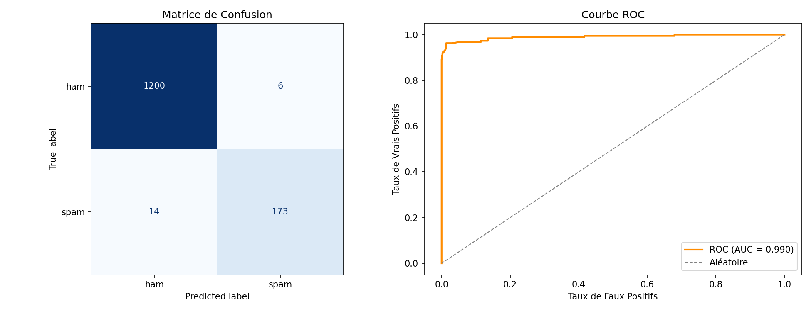

# 📱 Détecteur de Spam SMS — Naïve Bayes

Classification binaire (spam / ham) de SMS avec un modèle **Naïve Bayes Multinomial**, incluant une évaluation complète (matrice de confusion, courbe ROC, AUC).

## 🎯 Objectif

Appliquer les concepts vus en cours de Machine Learning (Naïve Bayes, métriques d'évaluation, ROC/AUC) sur un cas réel : la détection automatique de spam dans des messages SMS.

## 📊 Dataset

**SMS Spam Collection** — 5 572 SMS labellisés manuellement (`ham` = légitime, `spam` = indésirable), collectés à des fins de recherche académique sur le filtrage anti-spam.

- 4 825 messages `ham` (86.6%)
- 747 messages `spam` (13.4%)

## 🧠 Méthodologie

1. **Prétraitement** : vectorisation Bag-of-Words avec `CountVectorizer` (suppression des stop words, minuscules)
2. **Split** : 75% entraînement / 25% test, stratifié pour préserver la proportion spam/ham
3. **Modèle** : `MultinomialNB` (lissage de Laplace, α = 1.0)
4. **Évaluation** : accuracy, précision, rappel, F1-score, matrice de confusion, courbe ROC/AUC

## 📈 Résultats

| Métrique   | Valeur |
|------------|--------|
| Accuracy   | 98.6%  |
| Précision  | 96.7%  |
| Rappel     | 92.5%  |
| F1-score   | 94.5%  |
| AUC        | 0.990  |

Sur 1 393 messages de test : seulement **6 faux positifs** (ham classé spam) et **14 faux négatifs** (spam non détecté).



## 🔍 Mots les plus discriminants

- **Signalent le spam** : `claim`, `prize`, `tone`, `guaranteed`, `awarded`, `landline`, `www`, `150ppm`
- **Signalent un message normal** : `later`, `home`, `morning`, `come`, `ask`, `really`

Ces résultats sont cohérents avec l'intuition : les spams utilisent un vocabulaire commercial/urgent (offres, prix à payer), les messages normaux un vocabulaire du quotidien.

## 🚀 Utilisation

```bash
pip install pandas scikit-learn matplotlib
python spam_detector.py
```

## 📁 Structure

```
spam_detector/
├── spam_detector.py         # Script principal
├── sms.tsv                  # Dataset
├── resultats_evaluation.png # Graphiques (matrice de confusion + ROC)
└── README.md
```

## 💡 Pistes d'amélioration

- Comparer avec d'autres modèles (régression logistique, SVM) sur les mêmes métriques
- Utiliser `TfidfVectorizer` au lieu de `CountVectorizer` pour pondérer les mots rares
- Ajouter des features supplémentaires (longueur du message, nombre de chiffres, présence d'URL)
- Tester sur un dataset en français/arabe pour un cas d'usage marocain (ex: spam SMS bancaires)

---
*Projet réalisé dans le cadre de la Licence SDIA — Université Mohammed V de Rabat*
